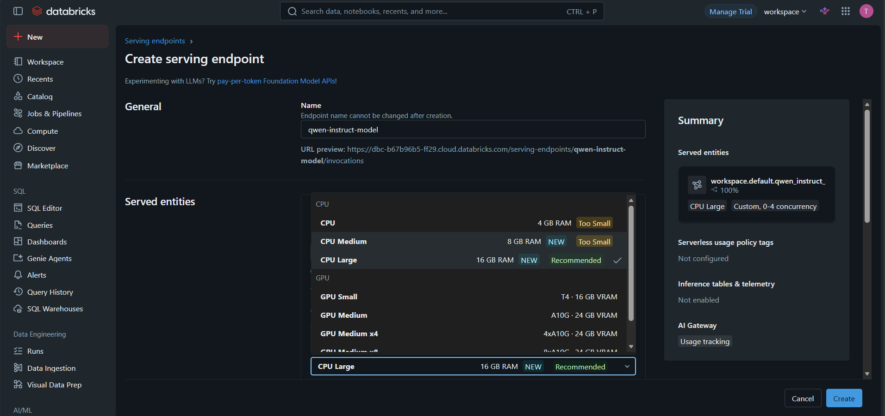

# Serving Qwen Model on Databricks

This repo deploys [Qwen/Qwen2.5-1.5B-Instruct](https://huggingface.co/Qwen/Qwen2.5-1.5B-Instruct) as an MLflow `pyfunc` model served on Databricks Model Serving. Given a text prompt, the endpoint returns a generated natural-language response.

- `model_serving.ipynb` — downloads the model, wraps it in an MLflow `pyfunc.PythonModel`, logs it to an MLflow experiment, and registers it in Unity Catalog.
- `inferencing.ipynb` — queries the deployed serving endpoint from a Python client.

---

Test the served model with this curl command:

```bash
curl \
  -H "Authorization: Bearer $DATABRICKS_TOKEN" \
  -H "Content-Type: application/json" \
  -X POST \
  -d '{"dataframe_split": {"columns": ["text"], "data": [["Give me a short introduction to large language models."]]}}' \
  https://dbc-b67b96b5-ff29.cloud.databricks.com/serving-endpoints/qwen_instruct_model/invocations
```

Generate a Databricks personal access token and set it as an environment variable, or replace `$DATABRICKS_TOKEN` with your token directly.

Expected response shape:

```json
{"predictions": [{"predictions": "Large Language Models (LLMs) are artificial intelligence systems..."}]}
```

---

## Reproducing the model serving setup on Databricks

### 1. Clone this repo into your Databricks workspace
Follow the [official documentation](https://docs.databricks.com/aws/en/repos/git-operations-with-repos) to clone a Git repo into Databricks.

### 2. Run `model_serving.ipynb` to create and register the model.
Replace model_download_dir and MLflow experiment path with your own workspace paths.

### 3. Serve the registered model
Find the registered model under Catalog Explorer → `workspace.default`, then create a serving endpoint by giving it a suitable name and selecting an appropriate compute size.


### 4. Run `inferencing.ipynb` to query the model.
Replace the url with your served model url.